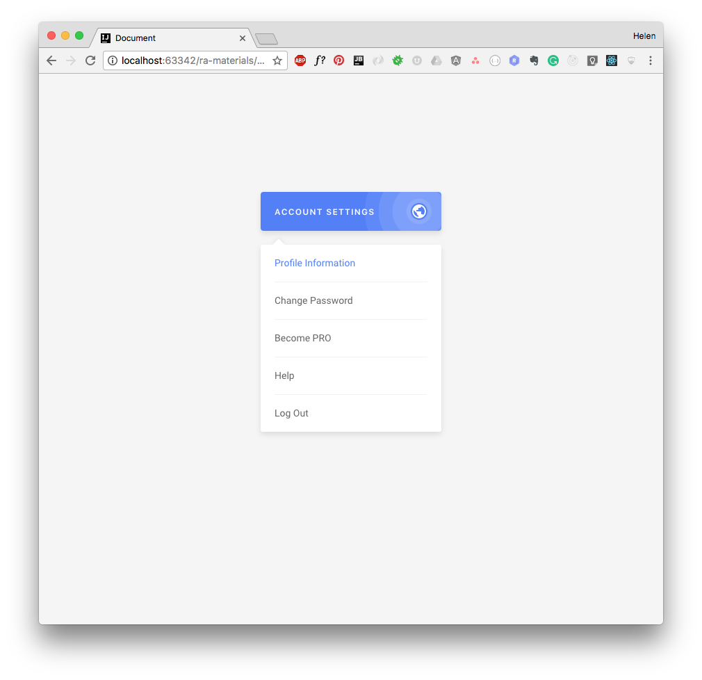
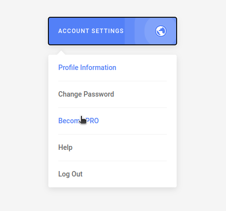

#  Выпадающий список

[вернуться в корневой readme](../README.md)

- [Задание](#задание)
- [Решение](#решение)


## Задание

Вам необходимо реализовать компоненты выпадающего списка.  


### Описание проекта
Реализуйте компонент DropdownList, аналогичный указанному на рисунке. Для позиционирования выпадающего списка воспользуйтесь контейнером с position: relatvie. Для простоты будем считать, что размер кнопки, при нажатии на которую показывается выпадающий список, фиксированный. Соответственно, вам не нужно через DOM API вычислять размеры и отступы.

Структура компонентов:

Dropdown — содержит кнопку и DropdownList, внутри себя хранит состояние, показывать или нет выпадающий список;
DropdownList — содержит список DropdownItem и хранит информацию о текущем выбранном элементе.
Вам нужно:  
- При клике на кнопку показывать и скрывать выпадающее меню.
- Отрисовывать список на базе массива, хранящегося в памяти, через map.
- Подсвечивать выбранный элемент в списке, сделайте это на базе inline-стилей.

[Вверх](#top)


## Решение

Немного странное ТЗ - хранить стейт списка меню в дочернем компоненте DropdownList, который должен перерендериваться, об этом и линтер подсказывает.

Корневой компонент App включает в себя родительский компонент **Dropdown**, использующий два стейта - стейт для хранения признака открытия меню и стейт для хранения активного пункта меню. \
Родительский компонент разделяется на два stateless компонента - **DropdownBtn** (кнопки) и **DropdownList** (в нем для отрисовки элементов списка использованы компоненты DropdownItem).

Структура компонентов
```pre
App
└── Dropdown
    ├── DropdownBtn
    └── DropdownList
        └── DropdownItem
```
В компонент DropdownBtn пропсом передается функция обработки клика по кнопке.

В компонент DropdownList пропсами передается состояние меню (открыто/закрыто), список пунктов меню, активный пункт меню и функция обработки клика по пункту меню.  
Тут что-то похожее на props hell, возможно, надо передавать один пропс в виде объекта.

Не реализован клик по окружающему компонент меню пространству для закрытия меню. 

Скриншот решения  



[Вверх](#top)
