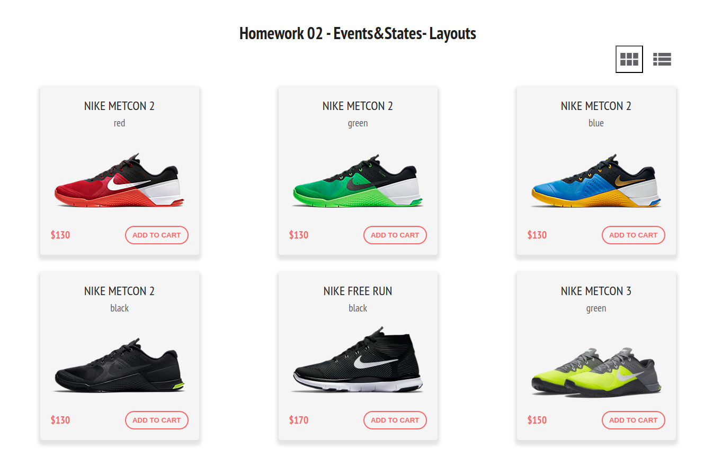
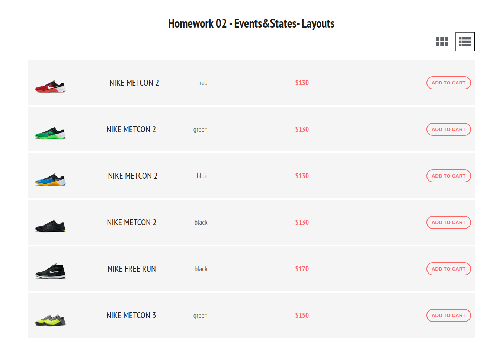

# Расположение товаров

- [Задание](#задание)
- [Решение](#решение)


## Задание

Вам необходимо сделать приложение для отображения товаров в интернет-магазине. Заказчик хочет, чтобы пользователь мог увидеть товары в виде карточек или в виде списка, в зависимости от того, какое расположение он выберет.


### Описание проекта
Реализуйте компонент Store, который управляет состоянием приложения, хранит список товаров в атрибуте products.

Иконка разметки, которая указывает на переключение между типами расположения товаров, реализована в компоненте без состояния IconSwitch, которому от Store мы передаём два свойства:
- icon — название иконки, которую хотим показать. Название иконки соответствует названию класса из библиотеки material icons. В нашем случае это либо view_list, либо view_module.
- onSwitch() — обработчик события, который реагирует на нажатие пользователем на иконку.
Пример:
```jsx
<IconSwitch icon={"view_list"} onSwitch={() => console.log("change state here")}/>
```

Сами товары отображаются в компонентах без состояния CardsView или ListView.

Компоненту CardsView от Store мы передаём свойство cards — массив с данными, каждый элемент из которого затем уже отображается с помощью карточки товара ShopCard.

То есть CardsView отображает много карточек ShopCard. На один товар — одна карточка ShopCard.

Компоненту ListView от Store мы передаём всего одно свойство items — массив с данными, каждый элемент из которого затем уже отображается с помощью ShopItem для товаров, которые мы хотим отобразить.

То есть ListView отображает много ShopItem. На один товар — один ShopItem.

Чтобы компонент Store мог реагировать на выбор пользователем вида разметки, в класс Store необходимо добавить состояние (state).

Ваша задача:

- установить состояние выбранного типа разметки в обработчике события, который Store передаёт в свойство onSwitch компонента IconSwitch;
- из компонента Store передать правильную иконку в свойство icon компонента IconSwitch;
- в компоненте Store отобразить товары в компоненте CardsView или ListView соответсвенно состоянию компонента App.

Не забудьте подключить Material Icons:
```css
@import url('https://fonts.googleapis.com/icon?family=Material+Icons')
```

Набор данных для отображения в @/data/products.js

[Вверх](#top)


## Решение

Картинки не оптимизированы ни по формату (вместо jpg надо webp, хотя на момент написания курса 2022 год? это было не модно), ни по размеру (300 на 300 для прямоугольного кроссовка?), при верстке компонента карточки пришлось использовать картинку товара в качестве фона вместо использования тега img.  
Шрифт подобран под скриншоты из ТЗ.  
Принято решение не использовать внешние ссылки, а подгружать картинки и иконки статикой из /public.  
Реализован базовый адаптив для мобильных устройств.

Корневой компонент App включает в себя родительский компонент **Store**, использующий state для хранения активного режима просмотра и\
разделяющийся на два stateless компонента - **IconSwitch** (кнопки) и **DataView** (базовый компонент для условной отрисовки товаров в зависимости от выбранного режима просмотра).

Структура компонентов
```pre
App
└── Store
    ├── IconSwitch
    └── DataView (используем условную отрисовку для отображения либо ListView, либо CardsView)
        ├── ListView -- ListItem отрисовываются в цикле перебора списка товаров
        └── CardsView -- CardItem отрисовываются в цикле перебора списка товаров
```
В компонент IconSwitch пропсами передается список режимов просмотра, активный режим и функция обработки. Отрисовываются все режимы, активный отмечен рамкой.

В компонент DataView пропсами передается активный режим просмотра и список товаров для отрисовки.

Скриншот решения с плиточной раскладкой


Скриншот решения со списком товаров в одну колонку



[Вверх](#top)